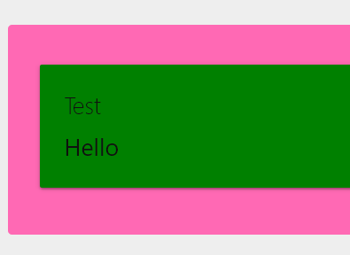

# UDStyle

Allows you to create CSS style sheets on the fly using [Emotion](https://emotion.sh).

# Installation

```
Install-Module UniversalDashboard.Style
```

# Example

Creates a new green card with a hot pink div around it that changes the text color when hovered. 

```
New-UDStyle -Style '
    padding: 32px;
    background-color: hotpink;
    font-size: 24px;
    border-radius: 4px;
    &:hover {
      color: white;
    }
    .card {
        background-color: green !important;   
    }' -Content {
        New-UDCard -Title 'Test' -Content {
            "Hello"
        }
    }
```

